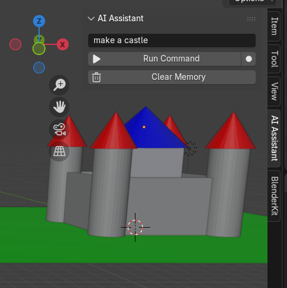

# Blender Voice & AI Assistant

**A natural language interface for Blender that turns speech and text into
real-time 3D scene manipulation.**



Control and manipulate 3D scenes using plain language or your voice. The add-on
translates human instructions into structured scene actions, letting you create,
modify, and transform objects inside Blender without navigating tools or menus.

## Overview

This project is a lightweight, AI-assisted workflow for Blender that lets you
interact with 3D scenes by describing what you want. It acts as a bridge between
human intent and Blender's Python API, helping both beginners and advanced users
work more efficiently.

It is designed to support:

- Rapid prototyping of 3D scenes
- Small in-scene adjustments during complex workflows
- Accessibility for users who can't rely on traditional keyboard/mouse workflows
- Natural interaction with 3D environments using voice or text

## Key Features

### Natural language scene control

Describe actions in plain English, for example:

- "Create a castle with four towers"
- "Make the sphere glow red"
- "Move the cube behind the structure"

The system interprets these and converts them into structured scene operations.

### Voice or text input

Use whichever fits your workflow:

- Typed commands
- Speech-to-text input for hands-free operation

### Scene manipulation

The assistant can:

- Create objects (cubes, spheres, cylinders, cones, planes, lights)
- Transform objects (move, scale, rotate), including relative placement such as
  "behind", "above", or "on" another object
- Modify materials (color, roughness, metallic, emission/glow)
- Adjust existing scene elements without rebuilding from scratch

### AI interpretation layer

Instead of mapping text directly to Blender commands, the system uses an
interpretation layer that understands *intent* and emits structured scene
actions. This enables flexible requests such as:

- "make it brighter"
- "make this look more metallic"
- "build a small castle with moody lighting"

### Conversation memory

The assistant remembers the conversation for the current session, so references
carry across commands — say "add a sphere", then "make it glow red", then "move
it behind the castle", and each "it" resolves to the same object.

## Use Cases

**Beginner friendly**
- Quickly generate simple 3D shapes
- Learn Blender through natural-language interaction
- Reduce reliance on complex UI navigation

**Advanced workflow assistance**
- Modify existing scenes without breaking your flow
- Rapidly prototype layouts and ideas
- Make scene adjustments during production (lighting, positioning, materials)

**Accessibility**
- Voice-driven 3D scene control for users with limited keyboard/mouse access
- A simpler interaction model for non-technical users

## How It Works (High Level)

1. You give a command (voice or text).
2. The system interprets your intent using an AI model, with the current scene
   and recent conversation as context.
3. The AI returns a structured scene plan.
4. Blender executes those actions through its Python API.
5. The scene updates immediately.

The intelligence lives in the interpretation layer; the execution layer is kept
deliberately simple, knowing only primitives, transforms, materials, and lights.
That separation is what makes the system open-ended — new kinds of scenes need
better prompting, not new code.

## Why This Project Matters

Traditional 3D workflows require deep familiarity with Blender's interface and
tools. This project explores a more intuitive model: you describe what you want
instead of constructing it step by step. It demonstrates how AI can act as an
interaction layer on top of creative software, improving accessibility and
reducing friction in 3D design.

## Installation & Setup

1. **Install the add-on.** In Blender: **Edit → Preferences → Add-ons →
   Install…**, select the add-on (zip the `addon/` folder, or use the provided
   `blender-ai-assistant.zip`), then enable **Blender AI Assistant**.
2. **Install the Python dependencies** into Blender's bundled Python. From
   Blender's Python Console (run Blender as administrator on Windows so it can
   write into the install folder):
   ```python
   import subprocess, sys
   subprocess.run([sys.executable, "-m", "pip", "install",
                   "anthropic", "SpeechRecognition", "pyaudio"])
   ```
   `anthropic` is required for all commands; `SpeechRecognition` and `pyaudio`
   are only needed for voice input.
3. **Add your API key.** Paste an Anthropic API key into the add-on's
   preferences (or set the `ANTHROPIC_API_KEY` environment variable). Get one at
   [console.anthropic.com](https://console.anthropic.com).
4. **Use it.** Press `N` in the 3D viewport, open the **AI Assistant** tab, and
   type or speak a command.

## Example

Input:

> "Create a glowing red sphere and place it above a cube"

Result:

- A cube is created
- A sphere is created above it, with an emissive red material
- Spatial positioning is applied automatically

(Switch the viewport to **Material Preview** or **Rendered** shading to see
glow and color.)

## Project Structure

```
blender-ai-assistant/
└── addon/
    ├── __init__.py   # registration + add-on preferences (API key)
    ├── ui.py         # sidebar panel and buttons
    ├── operator.py   # Run Command, Speak (voice), Clear Memory
    ├── llm.py        # interpretation layer + conversation memory
    ├── executor.py   # scene-action execution via bpy.ops
    └── voice.py      # microphone capture + speech-to-text
```

## Future Improvements

- Procedural scene generation (full environments from a single prompt)
- Deeper material and lighting understanding
- An undo/redo intelligence layer (one command = one undo step)
- Persistent memory saved with the `.blend` file
- Non-blocking voice and API calls so the viewport never freezes
- Offline speech recognition option (no audio leaves the machine)

## Notes

This is a hybrid tool — approachable for beginners exploring Blender, capable
enough to assist advanced scene workflows, and flexible enough to fit into
existing production pipelines.

## License

MIT License — see [LICENSE](LICENSE).
